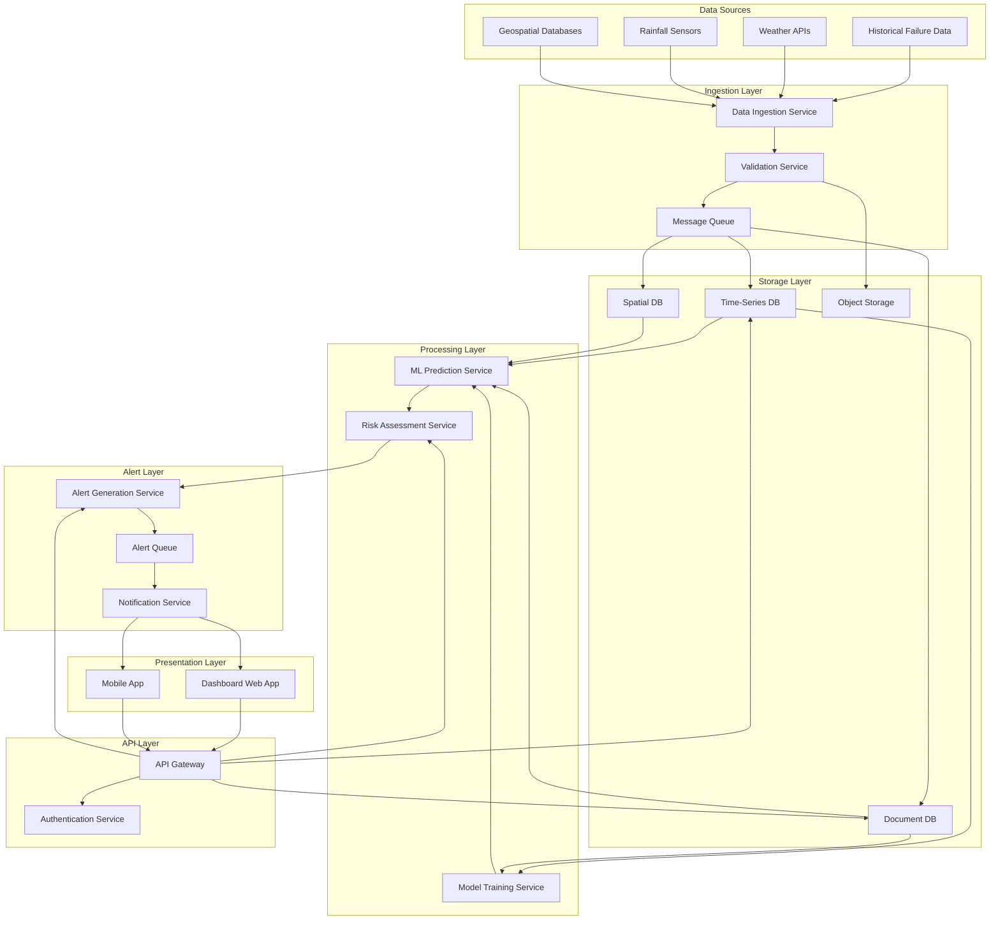

# Design Document: AI-Based Early Public Infrastructure Failure Warning System

## Overview

The AI-Based Early Public Infrastructure Failure Warning System is a cloud-native, microservices-based platform that predicts infrastructure failures across India using machine learning models trained on historical failure data, weather patterns, rainfall intensity, and geospatial information. The system provides real-time risk assessment, early warning alerts, and comprehensive monitoring capabilities for government authorities.

The architecture follows a distributed, event-driven design with independent microservices for data ingestion, ML prediction, alert generation, and notification delivery. All services are containerized and deployed on cloud infrastructure with auto-scaling capabilities to handle varying loads across India's diverse infrastructure landscape.

## Architecture

### High-Level Architecture



### Deployment Architecture

The system deploys on a cloud platform (AWS/Azure/GCP) with the following characteristics:

- **Multi-region deployment**: Primary region in Mumbai, secondary in Delhi for disaster recovery
- **Kubernetes orchestration**: All services run as containerized workloads with auto-scaling
- **Managed services**: Leverage cloud-managed databases, message queues, and object storage
- **CDN integration**: Dashboard assets served through CDN for fast global access
- **Load balancing**: Application load balancers distribute traffic across service instances

## Components and Interfaces

### 1. Data Ingestion Service

**Responsibility**: Collect data from external sources and route to validation service.

**Interfaces**:
```
POST /ingest/historical-failures
  Input: { source: string, format: "csv" | "json", data: string | object }
  Output: { ingestion_id: string, status: "queued", timestamp: ISO8601 }

POST /ingest/weather
  Input: { provider: string, api_key: string, regions: string[] }
  Output: { ingestion_id: string, records_fetched: number }

POST /ingest/rainfall
  Input: { sensor_id: string, intensity: number, location: {lat: number, lon: number}, timestamp: ISO8601 }
  Output: { ingestion_id: string, status: "accepted" }

POST /ingest/geospatial
  Input: { asset_id: string, coordinates: {lat: number, lon: number}, elevation: number, terrain: string }
  Output: { ingestion_id: string, status: "accepted" }
```

**Implementation Details**:
- Scheduled jobs poll weather APIs every 15 minutes
- Webhook endpoints receive real-time rainfall sensor data
- Batch upload endpoints for historical data with chunking support
- Rate limiting per source to prevent overload
- Idempotency keys to prevent duplicate ingestion

### 2. Validation Service

**Responsibility**: Validate incoming data against schema and business rules.

**Interfaces**:
```
ValidateHistoricalFailure(data: HistoricalFailureRecord) -> Result<ValidatedRecord, ValidationError>
ValidateWeatherData(data: WeatherRecord) -> Result<ValidatedRecord, ValidationError>
ValidateRainfallIntensity(data: RainfallRecord) -> Result<ValidatedRecord, ValidationError>
ValidateGeospatialData(data: GeospatialRecord) -> Result<ValidatedRecord, ValidationError>
```

**Validation Rules**:
- Historical failures: Required fields (date, location, asset_type, cause), date not in future
- Weather data: Temperature (-20°C to 55°C), humidity (0-100%), wind speed (0-200 km/h)
- Rainfall intensity: Non-negative, maximum 500 mm/hour
- Geospatial: Latitude (8-37°N), longitude (68-97°E), elevation (-10m to 9000m for India)

**Error Handling**:
- Log validation errors with source details
- Publish valid records to message queue
- Store invalid records in error bucket for manual review
- Emit metrics for validation success/failure rates

### 3. ML Prediction Service

**Responsibility**: Execute trained ML models to compute risk scores for infrastructure assets.

**Interfaces**:
```
POST /predict/risk-score
  Input: { 
    asset_id: string,
    historical_data: HistoricalFailureRecord[],
    weather_data: WeatherRecord,
    rainfall_data: RainfallRecord,
    geospatial_data: GeospatialRecord
  }
  Output: { 
    asset_id: string,
    risk_score: number,  // 0-100
    confidence: number,  // 0-1
    contributing_factors: { factor: string, weight: number }[],
    prediction_timestamp: ISO8601
  }

GET /predict/batch
  Input: { asset_ids: string[], region?: string }
  Output: { predictions: RiskPrediction[] }
```

**Model Architecture**:
- Ensemble of gradient boosting (XGBoost) and neural network models
- Feature engineering pipeline: temporal features, spatial features, weather aggregations
- Model versioning with A/B testing capability
- Prediction caching with 15-minute TTL

**Features Used**:
- Historical: failure frequency, time since last failure, failure severity
- Weather: temperature, humidity, wind speed, precipitation (current + 7-day forecast)
- Rainfall: current intensity, 24-hour cumulative, 7-day cumulative
- Geospatial: elevation, terrain type, proximity to water bodies, soil type
- Temporal: season, month, day of week, time since construction
- Asset-specific: age, material, last maintenance date, design capacity

### 4. Risk Assessment Service

**Responsibility**: Aggregate predictions and determine alert thresholds.

**Interfaces**:
```
POST /assess/asset
  Input: { asset_id: string }
  Output: { 
    asset_id: string,
    current_risk_score: number,
    risk_trend: "increasing" | "stable" | "decreasing",
    alert_level: "none" | "warning" | "critical",
    recommended_actions: string[]
  }

GET /assess/region
  Input: { region: string, min_risk_score?: number }
  Output: { 
    region: string,
    high_risk_assets: AssetRiskSummary[],
    aggregate_risk_score: number
  }

GET /assess/high-risk-zones
  Input: { min_risk_score: number }
  Output: { zones: HighRiskZone[] }
```

**Risk Assessment Logic**:
- Warning threshold: risk_score >= 60
- Critical threshold: risk_score >= 80
- Trend analysis: Compare current score with 7-day moving average
- Zone aggregation: Group assets within 10km radius with risk_score > 70

### 5. Alert Generation Service

**Responsibility**: Create alerts when risk thresholds are exceeded.

**Interfaces**:
```
POST /alerts/generate
  Input: { 
    asset_id: string,
    risk_score: number,
    alert_level: "warning" | "critical",
    predicted_failure_timeframe: string
  }
  Output: { 
    alert_id: string,
    created_at: ISO8601,
    status: "pending_notification"
  }

GET /alerts/active
  Input: { region?: string, severity?: string, limit?: number }
  Output: { alerts: Alert[] }

PATCH /alerts/{alert_id}/acknowledge
  Input: { user_id: string, notes?: string }
  Output: { alert_id: string, acknowledged_at: ISO8601, acknowledged_by: string }
```

**Alert Structure**:
```
Alert {
  alert_id: string
  asset_id: string
  asset_name: string
  asset_type: string
  location: { lat: number, lon: number, address: string }
  risk_score: number
  alert_level: "warning" | "critical"
  predicted_failure_timeframe: string
  contributing_factors: string[]
  recommended_actions: string[]
  created_at: ISO8601
  acknowledged: boolean
  acknowledged_by?: string
  acknowledged_at?: ISO8601
}
```

**Alert Deduplication**:
- Suppress duplicate alerts for same asset within 6 hours
- Update existing alert if risk_score increases by >10 points
- Auto-close alerts when risk_score drops below 50 for 24 hours

### 6. Notification Service

**Responsibility**: Deliver alerts through multiple channels to government authorities.

**Interfaces**:
```
POST /notify/send
  Input: { 
    alert_id: string,
    recipients: string[],
    channels: ("email" | "sms" | "push")[],
    priority: "normal" | "high"
  }
  Output: { 
    notification_id: string,
    delivery_status: { channel: string, status: "sent" | "failed", recipient: string }[]
  }

GET /notify/status/{notification_id}
  Output: { 
    notification_id: string,
    deliveries: { channel: string, recipient: string, status: string, delivered_at?: ISO8601 }[]
  }
```

**Channel Implementations**:
- **Email**: AWS SES / SendGrid with HTML templates
- **SMS**: Twilio / AWS SNS with 160-character limit
- **Push**: Firebase Cloud Messaging for mobile apps

**Delivery Logic**:
- Critical alerts: Send through all configured channels simultaneously
- Warning alerts: Send through primary channel only
- Retry failed deliveries: 3 attempts with exponential backoff (1min, 5min, 15min)
- Track delivery status and acknowledgment in database

**User Preferences**:
```
UserNotificationPreferences {
  user_id: string
  channels: { channel: string, enabled: boolean, contact: string }[]
  risk_threshold: number  // Only notify if risk_score >= threshold
  regions: string[]  // Only notify for assets in these regions
  asset_types: string[]  // Only notify for these asset types
  quiet_hours: { start: string, end: string }  // No notifications during these hours
}
```

### 7. Model Training Service

**Responsibility**: Retrain ML models periodically with new data.

**Interfaces**:
```
POST /training/trigger
  Input: { 
    model_type: "xgboost" | "neural_network" | "ensemble",
    training_data_start_date: ISO8601,
    training_data_end_date: ISO8601
  }
  Output: { 
    training_job_id: string,
    status: "queued",
    estimated_duration_minutes: number
  }

GET /training/status/{job_id}
  Output: { 
    job_id: string,
    status: "queued" | "running" | "completed" | "failed",
    progress_percent: number,
    metrics?: { accuracy: number, precision: number, recall: number, f1_score: number }
  }

POST /training/deploy
  Input: { model_version: string, deployment_strategy: "immediate" | "canary" | "blue_green" }
  Output: { deployment_id: string, status: "deploying" }
```

**Training Pipeline**:
1. Data extraction: Query historical failures, weather, rainfall, geospatial data
2. Feature engineering: Generate temporal, spatial, and aggregate features
3. Train/validation split: 80/20 split with temporal ordering preserved
4. Model training: Train multiple model types in parallel
5. Model evaluation: Compute metrics on validation set
6. Model selection: Choose best performing model or ensemble
7. Model registration: Store model artifacts with version and metadata
8. Deployment: Deploy to prediction service with rollback capability

**Automatic Retraining Triggers**:
- New historical failure records exceed 1000 since last training
- Model performance degrades below threshold (precision < 75% or recall < 80%)
- Scheduled monthly retraining regardless of data volume

### 8. API Gateway

**Responsibility**: Provide unified REST API for external integrations.

**Endpoints**:
```
# Authentication
POST /auth/login
POST /auth/refresh
POST /auth/logout

# Risk Queries
GET /api/v1/risk-scores?asset_id={id}
GET /api/v1/risk-scores?region={region}&min_score={score}
GET /api/v1/high-risk-zones

# Alerts
GET /api/v1/alerts?severity={level}&region={region}&from={date}&to={date}
GET /api/v1/alerts/{alert_id}
PATCH /api/v1/alerts/{alert_id}/acknowledge

# Assets
GET /api/v1/assets?region={region}&type={type}
GET /api/v1/assets/{asset_id}
GET /api/v1/assets/{asset_id}/history

# Reports
GET /api/v1/reports/risk-summary?region={region}&date={date}
GET /api/v1/reports/alert-statistics?from={date}&to={date}
```

**API Security**:
- Authentication: JWT tokens with 1-hour expiration
- Authorization: Role-based access control (Admin, Analyst, Viewer)
- Rate limiting: 1000 requests/minute per API key
- Request validation: JSON schema validation for all inputs
- Response sanitization: Remove sensitive fields based on user role

**API Documentation**:
- OpenAPI 3.0 specification
- Interactive documentation via Swagger UI
- Code examples in Python, JavaScript, Java, cURL

### 9. Dashboard Web Application

**Responsibility**: Provide visual interface for monitoring and analysis.

**Pages**:

1. **Map View**:
   - Interactive map showing all infrastructure assets
   - Color-coded markers by risk score (green/yellow/red)
   - Clustering for dense areas
   - Click asset for details popup
   - Filter by region, asset type, risk score range

2. **Alert Feed**:
   - Real-time list of active alerts
   - Auto-refresh every 30 seconds
   - Filter by severity, region, acknowledgment status
   - Acknowledge button for each alert
   - Export to CSV/PDF

3. **Asset Details**:
   - Asset information (name, type, location, age)
   - Current risk score with trend chart (30-day history)
   - Recent weather conditions
   - Failure history timeline
   - Recommended actions
   - Maintenance schedule

4. **Analytics Dashboard**:
   - Regional risk heatmap
   - Alert statistics (count by severity, region, time)
   - Model performance metrics
   - System health indicators
   - Prediction accuracy trends

5. **Administration**:
   - User management (create, edit, delete users)
   - Role assignment
   - Notification preferences configuration
   - System configuration
   - Audit log viewer

**Technology Stack**:
- Frontend: React with TypeScript
- State management: Redux Toolkit
- Mapping: Mapbox GL JS / Google Maps API
- Charts: Recharts / D3.js
- UI components: Material-UI / Ant Design
- Real-time updates: WebSocket connection for alerts

### 10. Authentication Service

**Responsibility**: Handle user authentication and authorization.

**Interfaces**:
```
POST /auth/login
  Input: { username: string, password: string, mfa_code?: string }
  Output: { access_token: string, refresh_token: string, expires_in: number }

POST /auth/refresh
  Input: { refresh_token: string }
  Output: { access_token: string, expires_in: number }

POST /auth/logout
  Input: { refresh_token: string }
  Output: { success: boolean }

GET /auth/verify
  Input: Authorization header with JWT
  Output: { user_id: string, role: string, permissions: string[] }
```

**Authentication Flow**:
1. User submits credentials
2. Validate credentials against user database
3. If MFA enabled, verify MFA code
4. Generate JWT access token (1-hour expiration)
5. Generate refresh token (7-day expiration)
6. Return tokens to client
7. Client includes access token in Authorization header for API requests
8. API Gateway validates token on each request

**Role-Based Access Control**:
- **Admin**: Full access to all features, user management, system configuration
- **Analyst**: Read/write access to alerts, assets, reports; no user management
- **Viewer**: Read-only access to dashboard, alerts, assets

**Multi-Factor Authentication**:
- Required for Admin role
- Optional for Analyst and Viewer roles
- TOTP-based (Google Authenticator, Authy)
- Backup codes for account recovery

## Data Models

### Infrastructure Asset
```
InfrastructureAsset {
  asset_id: string (UUID)
  name: string
  type: "bridge" | "road" | "dam" | "building" | "tunnel" | "railway" | "other"
  location: {
    lat: number
    lon: number
    address: string
    region: string
    state: string
  }
  geospatial: {
    elevation: number
    terrain: string
    soil_type: string
    proximity_to_water: number  // meters
  }
  construction: {
    year_built: number
    material: string
    design_capacity: string
    contractor: string
  }
  maintenance: {
    last_inspection_date: ISO8601
    last_maintenance_date: ISO8601
    next_scheduled_maintenance: ISO8601
    maintenance_history: MaintenanceRecord[]
  }
  current_risk_score: number
  risk_history: RiskScoreHistory[]
  created_at: ISO8601
  updated_at: ISO8601
}
```

### Historical Failure Record
```
HistoricalFailureRecord {
  failure_id: string (UUID)
  asset_id: string
  failure_date: ISO8601
  failure_type: "structural" | "material" | "weather" | "overload" | "age" | "other"
  severity: "minor" | "moderate" | "severe" | "catastrophic"
  cause: string
  description: string
  casualties: number
  economic_impact: number  // in INR
  weather_conditions: {
    temperature: number
    rainfall_24h: number
    wind_speed: number
  }
  repairs: {
    repair_date: ISO8601
    repair_cost: number
    repair_duration_days: number
  }
  created_at: ISO8601
}
```

### Weather Record
```
WeatherRecord {
  record_id: string (UUID)
  location: {
    lat: number
    lon: number
    region: string
  }
  timestamp: ISO8601
  temperature: number  // Celsius
  humidity: number  // percentage
  wind_speed: number  // km/h
  wind_direction: number  // degrees
  precipitation: number  // mm
  pressure: number  // hPa
  visibility: number  // km
  conditions: string  // "clear", "cloudy", "rain", "storm", etc.
  forecast: WeatherForecast[]  // 7-day forecast
  source: string  // API provider
  created_at: ISO8601
}
```

### Rainfall Record
```
RainfallRecord {
  record_id: string (UUID)
  sensor_id: string
  location: {
    lat: number
    lon: number
  }
  intensity: number  // mm/hour
  cumulative_24h: number  // mm
  cumulative_7d: number  // mm
  timestamp: ISO8601
  created_at: ISO8601
}
```

### Risk Prediction
```
RiskPrediction {
  prediction_id: string (UUID)
  asset_id: string
  risk_score: number  // 0-100
  confidence: number  // 0-1
  model_version: string
  contributing_factors: {
    factor: string
    weight: number
    value: any
  }[]
  predicted_failure_timeframe: string  // "24-48 hours", "3-7 days", "1-2 weeks", etc.
  recommended_actions: string[]
  prediction_timestamp: ISO8601
  input_data: {
    historical_failures_count: number
    current_weather: WeatherRecord
    current_rainfall: RainfallRecord
    asset_age_years: number
    days_since_maintenance: number
  }
}
```

### Alert
```
Alert {
  alert_id: string (UUID)
  asset_id: string
  asset_name: string
  asset_type: string
  location: {
    lat: number
    lon: number
    address: string
    region: string
  }
  risk_score: number
  alert_level: "warning" | "critical"
  predicted_failure_timeframe: string
  contributing_factors: string[]
  recommended_actions: string[]
  created_at: ISO8601
  acknowledged: boolean
  acknowledged_by?: string
  acknowledged_at?: ISO8601
  notes?: string
  status: "active" | "acknowledged" | "resolved" | "expired"
  notifications_sent: {
    notification_id: string
    channels: string[]
    sent_at: ISO8601
  }[]
}
```

### User
```
User {
  user_id: string (UUID)
  username: string
  email: string
  phone: string
  role: "admin" | "analyst" | "viewer"
  organization: string
  regions: string[]  // Authorized regions
  notification_preferences: {
    channels: {
      email: { enabled: boolean, address: string }
      sms: { enabled: boolean, phone: string }
      push: { enabled: boolean, device_tokens: string[] }
    }
    risk_threshold: number
    asset_types: string[]
    quiet_hours: { start: string, end: string }
  }
  mfa_enabled: boolean
  mfa_secret?: string
  last_login: ISO8601
  created_at: ISO8601
  updated_at: ISO8601
}
```

## Correctness Properties

*A property is a characteristic or behavior that should hold true across all valid executions of a system—essentially, a formal statement about what the system should do. Properties serve as the bridge between human-readable specifications and machine-verifiable correctness guarantees.*


### Data Ingestion Properties

**Property 1: CSV and JSON parsing completes within time bounds**
*For any* valid Historical_Failure_Data in CSV or JSON format with size up to 10MB, parsing and validation should complete within 5 minutes.
**Validates: Requirements 1.1**

**Property 2: Weather data fetch scheduling maintains correct intervals**
*For any* configured weather API source, fetch operations should be triggered at 15-minute intervals with maximum deviation of 30 seconds.
**Validates: Requirements 1.2**

**Property 3: Input validation correctly identifies valid and invalid data**
*For any* input data (rainfall intensity, geospatial coordinates), the validation service should accept all values within specified bounds and reject all values outside bounds.
**Validates: Requirements 1.3, 1.4**

**Property 4: Validation errors are logged and valid records continue processing**
*For any* batch of mixed valid and invalid records, all valid records should be processed successfully and all invalid records should be logged with source details.
**Validates: Requirements 1.5**

**Property 5: Ingestion round-trip with metadata**
*For any* successfully ingested data record, querying the storage system should return the same data with timestamp and source metadata attached.
**Validates: Requirements 1.6**

### ML Prediction Properties

**Property 6: Risk score prediction completes within time bounds**
*For any* Infrastructure_Asset with complete input data, computing the Risk_Score should complete within 30 seconds.
**Validates: Requirements 2.1**

**Property 7: Automatic retraining triggers at correct threshold**
*For any* sequence of Historical_Failure_Data additions, when the count of new records since last training reaches 1000, a retraining job should be automatically triggered.
**Validates: Requirements 2.2**

**Property 8: Model performance metrics are stored with predictions**
*For any* prediction batch execution, the system should store accuracy, precision, recall, and F1-score metrics alongside the predictions.
**Validates: Requirements 2.6**

### Alert Generation Properties

**Property 9: Alert generation timing based on risk threshold**
*For any* Infrastructure_Asset with Risk_Score exceeding threshold (60 for warning, 80 for critical), an alert should be generated within the specified time limit (2 minutes for warning, 1 minute for critical).
**Validates: Requirements 3.1, 3.2**

**Property 10: Risk score updates maintain required frequency**
*For any* monitored Infrastructure_Asset, the Risk_Score should be updated at least once every 30 minutes.
**Validates: Requirements 3.3**

**Property 11: Extreme weather triggers immediate reassessment**
*For any* Weather_Data indicating Rainfall_Intensity > 100 mm/hour, all Infrastructure_Assets within the affected region should have risk reassessment triggered immediately.
**Validates: Requirements 3.4**

**Property 12: Alert completeness**
*For any* generated Alert, it should contain all required fields: Infrastructure_Asset location, Risk_Score, predicted failure timeframe, and recommended actions.
**Validates: Requirements 3.6**

### Notification Properties

**Property 13: Notification delivery timing and channel selection**
*For any* generated Alert, notifications should be delivered to all registered Government_Authority contacts within 3 minutes, and critical alerts (Risk_Score > 80) should be sent through all configured channels simultaneously.
**Validates: Requirements 4.1, 4.3**

**Property 14: Notification preferences are applied correctly**
*For any* Government_Authority user with configured notification preferences (risk threshold, regions, asset types), they should only receive notifications for alerts matching their preferences.
**Validates: Requirements 4.4**

**Property 15: Notification retry with exponential backoff**
*For any* failed notification delivery, the system should retry up to 3 times with exponential backoff intervals (1min, 5min, 15min) and log all delivery failures.
**Validates: Requirements 4.5**

**Property 16: Notification acknowledgment tracking**
*For any* Alert with acknowledgments, the system should track which Government_Authority users have viewed the alert with timestamps.
**Validates: Requirements 4.6**

### Data Storage and Query Properties

**Property 17: Date-range query performance**
*For any* date-range query on Historical_Failure_Data spanning up to 10 years, the query should return results within 2 seconds.
**Validates: Requirements 6.1**

**Property 18: Streaming data processing latency**
*For any* Weather_Data or Rainfall_Intensity data ingested through streaming pipeline, the data should be available for querying within 10 seconds of ingestion.
**Validates: Requirements 6.2**

**Property 19: Spatial query performance**
*For any* radius query on Geospatial_Data with radius up to 100km, the query should return results within 1 second.
**Validates: Requirements 6.3**

**Property 20: Data partitioning correctness**
*For any* stored data record, it should be placed in the correct partition based on its geographic region and time period.
**Validates: Requirements 6.4**

**Property 21: Data archival moves old records to cold storage**
*For any* Historical_Failure_Data record older than 5 years, it should be moved to cold storage and remain queryable.
**Validates: Requirements 6.6**

### API Properties

**Property 22: Alert filtering returns correct results**
*For any* combination of filter parameters (severity, region, time range), the API should return only alerts matching all specified filters.
**Validates: Requirements 7.2**

**Property 23: Rate limiting enforcement**
*For any* API key, when request rate exceeds 1000 requests per minute, subsequent requests should be rejected with HTTP 429 status until the rate drops below threshold.
**Validates: Requirements 7.3**

**Property 24: Authentication requirement enforcement**
*For any* API endpoint request without valid authentication (API key or OAuth token), the request should be rejected with HTTP 401 status.
**Validates: Requirements 7.4**

**Property 25: API response format consistency**
*For any* API request (valid or malformed), the response should be valid JSON with appropriate HTTP status code (200 for success, 400 for malformed request, 401 for unauthorized, etc.) and descriptive error messages for failures.
**Validates: Requirements 7.5, 7.7**

### Dashboard Properties

**Property 26: Asset color-coding by risk score**
*For any* Infrastructure_Asset displayed on the map, its marker color should match its Risk_Score range (green: 0-40, yellow: 41-70, red: 71-100).
**Validates: Requirements 8.1**

**Property 27: Dashboard filtering correctness**
*For any* combination of filters (asset type, region, risk score range), the dashboard should display only assets matching all specified filters.
**Validates: Requirements 8.2**

**Property 28: Asset detail view completeness**
*For any* Infrastructure_Asset detail view, it should display all required information: historical Risk_Score trends, recent Weather_Data, and failure history.
**Validates: Requirements 8.4**

**Property 29: Report export format correctness**
*For any* report export request (PDF or CSV), the generated file should be in the correct format and contain all displayed data.
**Validates: Requirements 8.5**

### Security Properties

**Property 30: Role-based access control enforcement**
*For any* user with a specific role (Admin, Analyst, Viewer), they should only be able to perform actions permitted by their role, and unauthorized actions should be rejected.
**Validates: Requirements 9.3**

**Property 31: Audit logging completeness**
*For any* authentication attempt, API request, or data access operation, an audit log entry should be created containing user identity, action, timestamp, and result.
**Validates: Requirements 9.4**

**Property 32: Account locking on suspicious activity**
*For any* user account with 5 or more failed login attempts within 15 minutes, the account should be temporarily locked and administrators should be notified.
**Validates: Requirements 9.7**

### Multi-Region Properties

**Property 33: Regional authorization boundaries**
*For any* regional administrator or Government_Authority user, they should only be able to access and manage Infrastructure_Assets and view alerts within their authorized geographic regions.
**Validates: Requirements 10.2, 10.3**

**Property 34: Geographic alert routing**
*For any* Alert generated for an Infrastructure_Asset, notifications should be routed only to Government_Authority contacts whose authorized regions include the asset's location.
**Validates: Requirements 10.5**

**Property 35: Regional data isolation with national aggregation**
*For any* regional data query, results should only include data from that region, while national-level statistics should correctly aggregate data from all regions without exposing regional details to unauthorized users.
**Validates: Requirements 10.6**

## Error Handling

### Data Ingestion Errors

**Invalid Data Format**:
- Error: Data cannot be parsed as CSV or JSON
- Handling: Log error with source details, return 400 Bad Request, provide format examples
- Recovery: Client resubmits data in correct format

**Validation Failures**:
- Error: Data values outside acceptable ranges
- Handling: Log validation error with specific field and value, store in error bucket, continue processing valid records
- Recovery: Manual review of error bucket, data correction, resubmission

**External API Failures**:
- Error: Weather API unavailable or returns errors
- Handling: Retry with exponential backoff (3 attempts), log failure, use cached data if available, alert administrators if failures persist
- Recovery: Automatic retry on next scheduled fetch, manual investigation if persistent

**Data Source Timeout**:
- Error: Data source takes longer than 5 minutes to respond
- Handling: Cancel request, log timeout, mark source as temporarily unavailable
- Recovery: Retry on next scheduled interval, escalate if timeouts persist

### ML Prediction Errors

**Missing Input Data**:
- Error: Required input features unavailable for prediction
- Handling: Log missing features, use default values or historical averages where appropriate, flag prediction as low confidence
- Recovery: Prediction recomputed when missing data becomes available

**Model Inference Failure**:
- Error: Model throws exception during prediction
- Handling: Log error with input data hash, fall back to previous model version, alert ML team
- Recovery: Model debugging, fix deployment, rollback if necessary

**Prediction Timeout**:
- Error: Prediction takes longer than 30 seconds
- Handling: Cancel prediction, log timeout, return cached risk score if available
- Recovery: Investigate model performance, optimize or scale resources

**Model Performance Degradation**:
- Error: Model metrics fall below thresholds (precision < 75%, recall < 80%)
- Handling: Alert ML team, continue using current model, trigger retraining
- Recovery: Retrain model with recent data, validate performance, deploy if improved

### Alert Generation Errors

**Alert Generation Timeout**:
- Error: Alert not generated within required time (1-2 minutes)
- Handling: Log timeout, generate alert anyway, alert system administrators
- Recovery: Investigate system load, scale resources if needed

**Duplicate Alert Detection**:
- Error: Alert already exists for same asset within 6 hours
- Handling: Update existing alert if risk score increased by >10 points, otherwise suppress
- Recovery: No action needed, working as designed

**Alert Storage Failure**:
- Error: Cannot persist alert to database
- Handling: Retry 3 times, log failure, send notification anyway, queue alert for later persistence
- Recovery: Database investigation, alert recovery from notification logs

### Notification Errors

**Notification Delivery Failure**:
- Error: Email/SMS/push notification fails to send
- Handling: Retry up to 3 times with exponential backoff (1min, 5min, 15min), log all attempts, mark as failed if all retries exhausted
- Recovery: Manual notification through alternative channels, investigate delivery service

**Invalid Contact Information**:
- Error: Email address invalid, phone number unreachable
- Handling: Log error, skip that contact, notify user to update contact information
- Recovery: User updates contact information in preferences

**Notification Service Unavailable**:
- Error: Email/SMS service provider down
- Handling: Queue notifications for retry, attempt alternative channels, alert administrators
- Recovery: Automatic retry when service restored, manual notification if critical

**Rate Limit Exceeded**:
- Error: Notification service rate limit reached
- Handling: Queue notifications, send at maximum allowed rate, prioritize critical alerts
- Recovery: Automatic processing of queue, consider additional service capacity

### API Errors

**Authentication Failure**:
- Error: Invalid API key or expired OAuth token
- Handling: Return 401 Unauthorized with error message, log attempt
- Recovery: Client refreshes token or provides valid API key

**Authorization Failure**:
- Error: User lacks permission for requested resource
- Handling: Return 403 Forbidden with error message, log attempt
- Recovery: User requests access from administrator

**Rate Limit Exceeded**:
- Error: Client exceeds 1000 requests/minute
- Handling: Return 429 Too Many Requests with Retry-After header, log violation
- Recovery: Client implements backoff, requests rate limit increase if needed

**Malformed Request**:
- Error: Invalid JSON, missing required fields, invalid parameter values
- Handling: Return 400 Bad Request with descriptive error message indicating specific issue
- Recovery: Client corrects request format

**Resource Not Found**:
- Error: Requested asset, alert, or resource doesn't exist
- Handling: Return 404 Not Found with error message
- Recovery: Client verifies resource ID

**Internal Server Error**:
- Error: Unexpected exception in API handler
- Handling: Return 500 Internal Server Error, log full stack trace, alert on-call engineer
- Recovery: Bug fix and deployment

### Database Errors

**Connection Failure**:
- Error: Cannot connect to database
- Handling: Retry with exponential backoff, use read replica if available, return 503 Service Unavailable to clients
- Recovery: Database investigation, failover to backup if needed

**Query Timeout**:
- Error: Query exceeds timeout threshold
- Handling: Cancel query, log slow query, return partial results if available or error to client
- Recovery: Query optimization, index creation, data partitioning

**Storage Full**:
- Error: Database storage capacity reached
- Handling: Alert administrators, trigger data archival, reject new writes with error
- Recovery: Increase storage capacity, archive old data

**Replication Lag**:
- Error: Read replica significantly behind primary
- Handling: Route reads to primary if lag exceeds threshold, alert administrators
- Recovery: Investigate replication issues, scale replica resources

### System-Wide Errors

**Service Unavailable**:
- Error: Microservice down or unhealthy
- Handling: Circuit breaker opens, route traffic to healthy instances, return 503 to clients, alert on-call
- Recovery: Service restart, investigation, scaling if needed

**Resource Exhaustion**:
- Error: CPU, memory, or disk space critically low
- Handling: Trigger auto-scaling, shed non-critical load, alert administrators
- Recovery: Scale resources, optimize resource usage, investigate leaks

**Cascading Failures**:
- Error: Failure in one service causing failures in dependent services
- Handling: Circuit breakers prevent cascade, degrade gracefully, maintain core functionality
- Recovery: Fix root cause, gradually restore services

## Testing Strategy

### Dual Testing Approach

The system requires both unit testing and property-based testing for comprehensive coverage:

- **Unit tests**: Verify specific examples, edge cases, error conditions, and integration points
- **Property tests**: Verify universal properties across all inputs through randomized testing

Both approaches are complementary and necessary. Unit tests catch concrete bugs and validate specific scenarios, while property tests verify general correctness across a wide input space.

### Property-Based Testing

**Framework Selection**:
- **Python services**: Use Hypothesis library
- **TypeScript/JavaScript services**: Use fast-check library
- **Java services**: Use jqwik library

**Configuration**:
- Each property test must run minimum 100 iterations
- Each test must reference its design document property using a comment tag
- Tag format: `# Feature: infrastructure-failure-warning-system, Property {number}: {property_text}`

**Example Property Test (Python with Hypothesis)**:
```python
from hypothesis import given, strategies as st
import pytest

# Feature: infrastructure-failure-warning-system, Property 3: Input validation correctly identifies valid and invalid data
@given(
    rainfall_intensity=st.floats(min_value=-100, max_value=1000),
)
def test_rainfall_validation_property(rainfall_intensity):
    """Property: Validation should accept values in [0, 500] and reject all others"""
    result = validate_rainfall_intensity(rainfall_intensity)
    
    if 0 <= rainfall_intensity <= 500:
        assert result.is_valid, f"Valid rainfall {rainfall_intensity} was rejected"
    else:
        assert not result.is_valid, f"Invalid rainfall {rainfall_intensity} was accepted"
```

**Example Property Test (TypeScript with fast-check)**:
```typescript
import fc from 'fast-check';

// Feature: infrastructure-failure-warning-system, Property 22: Alert filtering returns correct results
describe('Alert Filtering Property', () => {
  it('should return only alerts matching all filters', () => {
    fc.assert(
      fc.property(
        fc.array(alertArbitrary()),
        fc.record({
          severity: fc.option(fc.constantFrom('warning', 'critical')),
          region: fc.option(fc.string()),
          minRiskScore: fc.option(fc.integer({ min: 0, max: 100 })),
        }),
        (alerts, filters) => {
          const filtered = filterAlerts(alerts, filters);
          
          // All returned alerts must match filters
          filtered.forEach(alert => {
            if (filters.severity) {
              expect(alert.alert_level).toBe(filters.severity);
            }
            if (filters.region) {
              expect(alert.location.region).toBe(filters.region);
            }
            if (filters.minRiskScore) {
              expect(alert.risk_score).toBeGreaterThanOrEqual(filters.minRiskScore);
            }
          });
          
          // All matching alerts must be returned
          const expectedCount = alerts.filter(alert => {
            if (filters.severity && alert.alert_level !== filters.severity) return false;
            if (filters.region && alert.location.region !== filters.region) return false;
            if (filters.minRiskScore && alert.risk_score < filters.minRiskScore) return false;
            return true;
          }).length;
          
          expect(filtered.length).toBe(expectedCount);
        }
      ),
      { numRuns: 100 }
    );
  });
});
```

### Unit Testing

**Framework Selection**:
- **Python services**: pytest
- **TypeScript/JavaScript services**: Jest
- **Java services**: JUnit 5

**Coverage Requirements**:
- Minimum 80% code coverage for all services
- 100% coverage for critical paths (alert generation, notification delivery, risk prediction)

**Unit Test Focus Areas**:
1. **Specific Examples**: Test known scenarios with expected outcomes
2. **Edge Cases**: Empty inputs, boundary values, maximum sizes
3. **Error Conditions**: Invalid inputs, service failures, timeouts
4. **Integration Points**: Service-to-service communication, database interactions
5. **Business Logic**: Risk score calculation, alert threshold logic, notification routing

**Example Unit Test (Python with pytest)**:
```python
import pytest
from datetime import datetime

def test_alert_generation_for_critical_risk():
    """Test that critical alert is generated when risk score exceeds 80"""
    asset = create_test_asset(asset_id="bridge-001")
    risk_prediction = RiskPrediction(
        asset_id="bridge-001",
        risk_score=85,
        confidence=0.92,
        prediction_timestamp=datetime.now()
    )
    
    alert = generate_alert(asset, risk_prediction)
    
    assert alert is not None
    assert alert.alert_level == "critical"
    assert alert.risk_score == 85
    assert alert.asset_id == "bridge-001"
    assert "location" in alert.__dict__
    assert "recommended_actions" in alert.__dict__

def test_alert_not_generated_for_low_risk():
    """Test that no alert is generated when risk score is below threshold"""
    asset = create_test_asset(asset_id="bridge-002")
    risk_prediction = RiskPrediction(
        asset_id="bridge-002",
        risk_score=45,
        confidence=0.88,
        prediction_timestamp=datetime.now()
    )
    
    alert = generate_alert(asset, risk_prediction)
    
    assert alert is None

def test_alert_generation_with_missing_location():
    """Test error handling when asset location is missing"""
    asset = create_test_asset(asset_id="bridge-003", location=None)
    risk_prediction = RiskPrediction(
        asset_id="bridge-003",
        risk_score=85,
        confidence=0.92,
        prediction_timestamp=datetime.now()
    )
    
    with pytest.raises(ValueError, match="Asset location is required"):
        generate_alert(asset, risk_prediction)
```

### Integration Testing

**Scope**: Test interactions between multiple services

**Test Scenarios**:
1. End-to-end data flow: Ingestion → Validation → Storage → Prediction → Alert → Notification
2. API authentication and authorization flow
3. Database failover and recovery
4. Message queue processing
5. External API integration (weather services)

**Tools**:
- Docker Compose for local multi-service testing
- Testcontainers for database and message queue dependencies
- Mock servers for external APIs

### Performance Testing

**Load Testing**:
- Simulate 100,000 infrastructure assets
- Test API throughput: 1000 requests/second
- Test alert generation under load: 1000 concurrent alerts
- Test notification delivery: 10,000 concurrent notifications

**Tools**: Apache JMeter, Gatling, or k6

**Stress Testing**:
- Gradually increase load until system degradation
- Identify bottlenecks and breaking points
- Verify graceful degradation and recovery

**Latency Testing**:
- Measure end-to-end latency for critical paths
- Verify SLA compliance (prediction < 30s, alert generation < 2min, notification < 3min)

### Security Testing

**Authentication Testing**:
- Test invalid credentials rejection
- Test token expiration and refresh
- Test MFA enforcement for admin users

**Authorization Testing**:
- Test role-based access control
- Test regional data isolation
- Test privilege escalation prevention

**Penetration Testing**:
- SQL injection attempts
- XSS and CSRF attacks
- API abuse and rate limit bypass
- Sensitive data exposure

**Tools**: OWASP ZAP, Burp Suite

### Monitoring and Observability

**Metrics Collection**:
- Request rates, latency, error rates for all services
- Database query performance
- ML model prediction latency and accuracy
- Alert generation and notification delivery rates
- Resource utilization (CPU, memory, disk, network)

**Logging**:
- Structured logging with correlation IDs
- Log levels: DEBUG, INFO, WARN, ERROR, CRITICAL
- Centralized log aggregation (ELK stack or CloudWatch)

**Tracing**:
- Distributed tracing for request flows across services
- OpenTelemetry instrumentation
- Trace visualization (Jaeger or Zipkin)

**Alerting**:
- Alert on SLA violations
- Alert on error rate spikes
- Alert on resource exhaustion
- Alert on security events

**Dashboards**:
- System health dashboard
- Business metrics dashboard (alerts generated, notifications sent, assets monitored)
- ML model performance dashboard
- Cost monitoring dashboard

### Continuous Integration/Continuous Deployment

**CI Pipeline**:
1. Code checkout
2. Dependency installation
3. Linting and code formatting checks
4. Unit tests execution
5. Property tests execution (100 iterations minimum)
6. Integration tests execution
7. Code coverage report
8. Security scanning (dependency vulnerabilities, SAST)
9. Docker image build
10. Image scanning
11. Artifact publishing

**CD Pipeline**:
1. Deploy to staging environment
2. Run smoke tests
3. Run integration tests against staging
4. Manual approval gate
5. Blue-green deployment to production
6. Health checks
7. Gradual traffic shift
8. Rollback on failure

**Tools**: GitHub Actions, GitLab CI, Jenkins, or CircleCI

### Test Data Management

**Synthetic Data Generation**:
- Generate realistic infrastructure asset data
- Generate historical failure records with patterns
- Generate weather and rainfall data with seasonal variations
- Generate geospatial data covering all Indian regions

**Data Privacy**:
- Anonymize production data for testing
- Use synthetic data for development and testing
- Secure test data storage and access

**Test Data Refresh**:
- Refresh test databases daily
- Maintain consistent test data for regression testing
- Version control test data schemas
